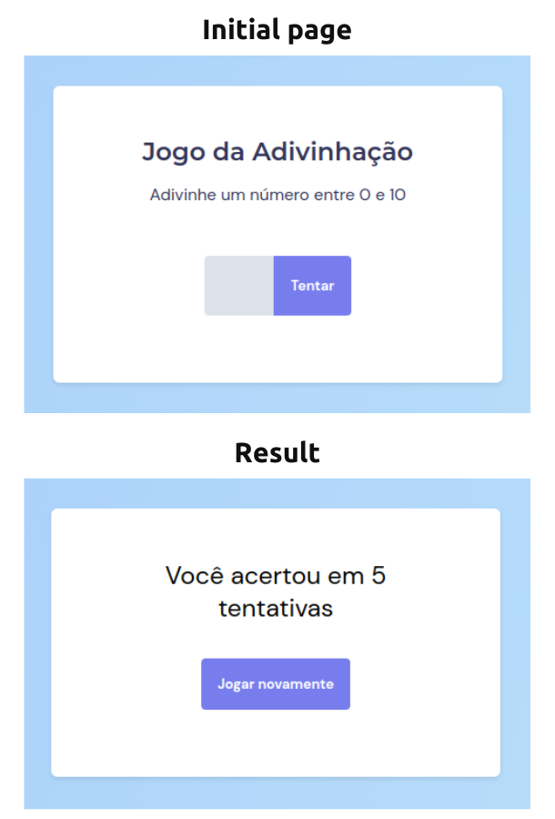

# Guessing game
  
> Status: Developed ✅

  
### Guessing game for a random number between 1 and 10, which counts a number of attempts made until the random number is correct.

### Technologies used:
* HTML
* CSS
* JAVASCRIPT

### Challenges encountered in the development of the project
I had some difficulties during the development of this project, in Javascript syntax (which I am improving my knowledge), and parallel to that, in programming logic.
